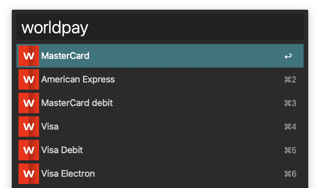

# Alfred Workflows

A bunch of workflows for [Alfred 2](http://www.alfredapp.com) which make my life easier, use any of them if you want!

These are all customised to my machine (I'm treating this repo as a backup mainly), but easily adjusted to another environment.

Some more useful repos can be found at [Shed](https://github.com/shedhq/alfred-workflows).

## Open [Repository] Folder

Opens up `~/Sites/GitRepos` in finder from a keyword. I know this is built-in functionality, but I found typing `repos` wouldn't always give me the exact folder I wanted (despite the screenshot showing otherwise >_<). This changes that. The alt modifier will open the `origin` in the default browser, and the `command` modifier will open the repo in Terminal.

    repos

You can copy the existing nodes in the workflow and add more keyword aliases if needed, too.

## Copy `now()` to clipboard

Copies the current time to the clipboard, in the format YYYY-MM-DD HH:MM:SS (useful for pasting into databases etc). You can also adjust the output by specifying an aritmitic operation (e.g. + 14 days) or a timezone.

    now {timezone}
    now {+/- [number] years}
    now {+/- [number] months}
    now {+/- [number] weeks}
    now {+/- [number] days}
    now {+/- [number] hours}
    now {+/- [number] minutes}
    now {+/- [number] seconds}

## Generate MD5 hash of a string

Copies an md5 hash of a string to the clipboard, if no argument is passed then the current time is used.

    md5 {query}

## Copy SSH Key to clipboard

Looks for public SSH keys in `~/.ssh` and offers them up to copy onto the clipboard

    ssh

## SSH into Digital Ocean Droplets

Searches digital ocean droplets and opens a new terminal window with an ssh connection

    doctl {query}

## Copy Stripe test card to clipboard

Copies the card number for various Stripe test cards to the clipboard

    stripe {filter}
    

## Copy WorldPay test card to clipboard

Copies the card number for various WorldPay test cards to the clipboard

    worldpay {filter}
    

