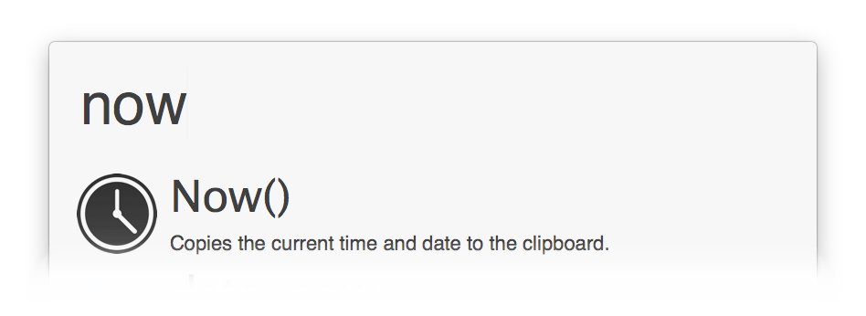

# Copy `now()` to clipboard

Copies the current time to the clipboard, in the format YYYY-MM-DD HH:MM:SS (useful for pasting into databases etc). Optionally specify the timezone as an argument (defaults to UTC).

    now {timezone}

You can copy the existing nodes in the workflow and add more keyword aliases if needed, too.

